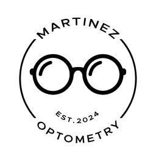

<div align="center">



# Óptica Martínez

### Landing 3D · Óptica en Loja, Ecuador

**Mira bien, luce increíble.**

Examen visual gratis · Armazones de marca · 5.0 ★ en Google

[Instagram](https://www.instagram.com/martinezoptometry/) ·
[TikTok](https://www.tiktok.com/@optica.martinez.o) ·
[WhatsApp](https://wa.me/593967794351)

</div>

---

Landing page moderna con un **hero 3D interactivo** (unas gafas que siguen el mouse,
modeladas con el estilo del logo de la marca), diseño editorial, videos reales del
negocio y datos verídicos de la óptica. Pensada para verse increíble en desktop y
celular, y para que Google la encuentre bien.

## ✨ Características

- **Hero 3D** con gafas modeladas en tiempo real (React Three Fiber): siguen el
  cursor con damping suave, material de acetato negro y reflejo tipo logo.
- **Diseño editorial** blanco + azul índigo de la marca, con tipografía
  **Fraunces** (display) + **Geist**.
- **Sección de Reels** con los videos reales del TikTok (autoplay silencioso,
  carga diferida).
- **Cartel de optometría** que pasa de borroso a nítido al hacer scroll.
- **Reseñas reales** de Google (con opción de traerlas en vivo vía Places API).
- **SEO local**: datos estructurados (Schema.org `Optician`), `og:image`,
  horario y botón "Cómo llegar".
- **Responsive** y con micro-animaciones (Framer Motion).

## 🛠️ Stack

| | |
|---|---|
| Framework | [TanStack Start](https://tanstack.com/start) (SSR) + React 19 |
| 3D | [`@react-three/fiber`](https://r3f.docs.pmnd.rs) + `@react-three/drei` + three.js |
| Estilos | Tailwind CSS v4 |
| Animación | Framer Motion |
| Lenguaje | TypeScript |

## 🚀 Desarrollo

```bash
npm install
npm run dev      # http://localhost:8080
```

## 📦 Producción

```bash
npm run build    # genera dist/ (cliente + servidor SSR)
npm run preview  # previsualiza el build
```

## ⭐ Reseñas en vivo de Google (opcional)

Por defecto se muestran reseñas reales ya curadas. Para traerlas en vivo desde
Google Places:

1. Copia `.env.example` a `.env`.
2. Crea una **API key** en Google Cloud con **Places API** habilitada.
3. Pega la key en `GOOGLE_PLACES_API_KEY` (el `GOOGLE_PLACE_ID` ya está incluido).
4. Reinicia el servidor.

## 📁 Estructura

```
src/
  routes/
    __root.tsx        # layout, <head>, fuentes, favicon
    index.tsx         # toda la landing (hero, servicios, reseñas, footer…)
  components/
    Glasses3D.tsx     # gafas 3D del hero
    Reels.tsx         # videos del TikTok
    EyeChart.tsx      # cartel de optometría
    BrandStrip.tsx    # franja de marcas
  lib/
    reviews.ts        # reseñas (fallback + Google Places opcional)
  styles.css          # tokens de diseño (paleta, tipografía)
public/               # logo, favicon, og-image, videos
```

## 📍 El negocio

**Óptica Martínez** · Plaza TOA, Simón Bolívar entre Lourdes y Catacocha, Loja, Ecuador
Lun–Vie 9:30–20:30 · Sáb 10:00–18:30 · Dom cerrado
WhatsApp / Tel. +593 99 133 7101

---

<div align="center">
Hecho con 💙 por <a href="https://indagalab.com">Indaga Lab</a>
</div>
